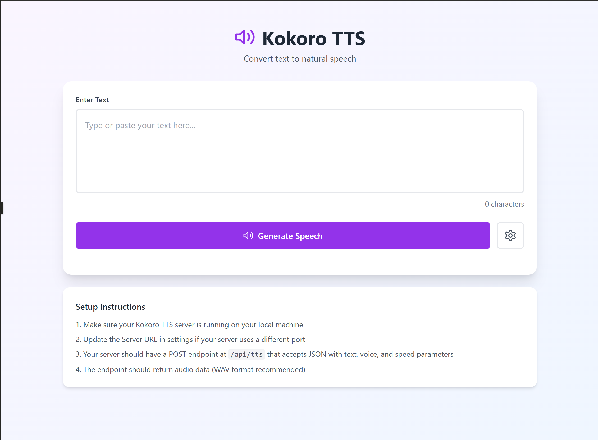

# 🎙️ Kokoro TTS Web App

Convert text into **natural-sounding speech** using the **Kokoro Text-to-Speech (TTS)** engine.  
This web app provides a simple, elegant interface built with **React + TypeScript + TailwindCSS**, allowing you to send text to your local Kokoro TTS API and instantly generate audio output.

---

## 🚀 Features

- 🎧 Real-time text-to-speech conversion  
- 🧠 Connects directly to your Kokoro TTS server  
- ⚡ Built with React + TypeScript + TailwindCSS  
- 🎨 Minimal and responsive UI  
- 💾 Exports audio in WAV format  

---

## 🛠️ Setup

### 1. Clone the repository
```bash
git clone https://github.com/Hboahen42/tts.git
cd kokoro-tts-web
```

### 2. Install dependencies
```bash
npm install
```

### 3. Install and configure TailwindCSS
If not already set up:
```bash
npm install tailwindcss @tailwindcss/vite
```
Add the @tailwindcss/vite plugin to your Vite configuration (vite.config.ts).
```js
import { defineConfig } from 'vite'
import tailwindcss from '@tailwindcss/vite'

export default defineConfig({
  plugins: [
    tailwindcss(),
  ],
})
```

Then in your `src/index.css`:
```css
@import "tailwindcss";
```

---

## 🧩 Running the App

Start the development server:
```bash
npm run dev
```

Then open [http://localhost:5173](http://localhost:5173) in your browser.

---

## 🔗 Connecting to Kokoro TTS

Make sure your **Kokoro TTS server** is running locally.

Default endpoint:
```
POST http://localhost:8880/v1/audio/speech
```

Example JSON payload:
```json
{
  "model": "kokoro",
  "input": "Hello from Kokoro",
  "voice": "af_sky",
  "response_format": "wav",
  "speed": 1.0
}
```

Returned output should be audio data (WAV recommended).

---

## 🖼️ UI Preview



---

## ⚙️ Requirements

- Node.js ≥ 18  
- npm ≥ 9  
- Kokoro TTS server running locally  

---

## 🤝 Contributing

Pull requests are welcome!  
If you find bugs or have ideas for improvement, open an issue or PR.

---

## 📜 License

This project is licensed under the [MIT License](LICENSE).

---

**Built with ❤️ by Humphrey Boahen**
